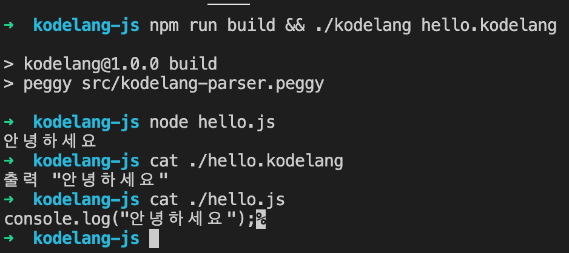

# kodelang-js

한국어로된 
특수목적의 프로그래밍 언어를 만들어
자동화와 사고의 확장을 도모한다



## 할일 (Todo)

- [ ] 특수목적 설정
- [ ] 문법 및 용어 정의 
- [ ] web용 환경 구축

## 사용법
```
git clone git@github.com:hongsw/kodelang-js.git
npm i
npm run build
./kodelang hello.kodelang 
node hello.js
```
